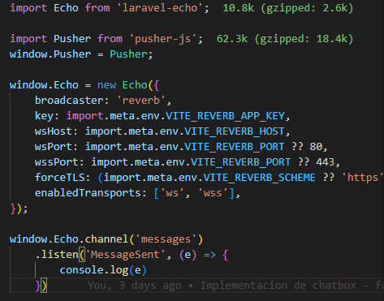

# 🧪 Laravel Reverb + Livewire + Queues (Broadcast en Tiempo Real)
⚙️ Instalación
php artisan install:broadcast

# Durante la instalación:
Aceptar instalar Laravel Reverb → Yes
Aceptar instalar dependencias de Node → Yes

# ▶️ Cómo iniciar el proyecto
php artisan reverb:start   # Inicia el servidor WebSocket
npm run dev                # Compila assets JS/CSS
php artisan serve          # Inicia el servidor Laravel

# 📡 Visualizar mensajes WebSocket en el navegador
Para ver los mensajes que llegan en tiempo real, configurá resources/js/echo.js. Esto conecta Echo con Reverb y te permite ver la actividad en la pestaña WebSockets de las DevTools del navegador.

# 📤 Crear evento MessageSent
php artisan make:event MessageSent

# Archivo generado: app/Events/MessageSent.php
namespace App\Events;

use Illuminate\Broadcasting\PrivateChannel;
use Illuminate\Contracts\Broadcasting\ShouldBroadcast;
use Illuminate\Foundation\Events\Dispatchable;
use Illuminate\Queue\SerializesModels;

class MessageSent implements ShouldBroadcast
{
    use Dispatchable, SerializesModels;

    public function __construct(
        public string $name,
        public string $text
    ) {}

    public function broadcastOn(): PrivateChannel
    {
        return new PrivateChannel('messages');
    }
}

Este evento permite emitir mensajes a través de un canal privado llamado messages. Cualquier componente suscrito podrá recibirlo en tiempo real.

# 💬 Crear comando para probar envío de mensajes
php artisan make:command SendMessageCommand

# Archivo generado: app/Console/Commands/SendMessageCommand.php
namespace App\Console\Commands;

use App\Events\MessageSent;
use Illuminate\Console\Command;
use function Laravel\Prompts\text;

class SendMessageCommand extends Command
{
    protected $signature = 'send:message';
    protected $description = 'Send a message to the chat';

    public function handle()
    {
        $name = text('¿Cuál es tu nombre?', required: true);
        $text = text('¿Cuál es tu mensaje?', required: true);

        MessageSent::dispatch($name, $text);
    }
}

Este comando permite enviar mensajes desde la consola para probar el sistema en tiempo real.

# ⚙️ Configuración de colas
En .env:

QUEUE_CONNECTION=sync
QUEUE_CONNECTION=redis

Para procesar trabajos de cola:

php artisan queue:work

# 🧱 Crear componente Livewire
php artisan make:livewire ChatBox
Se generarán:

app/Livewire/ChatBox.php

resources/views/livewire/chat-box.blade.php

Agregar el componente en tu layout, por ejemplo en resources/views/layouts/app.blade.php:

@livewire('chat-box')

# 💬 Lógica del componente ChatBox
namespace App\Livewire;

use App\Events\MessageSent;
use Livewire\Component;
use Livewire\Attributes\On;

class ChatBox extends Component
{
    public array $messages = [];
    public string $message = '';

    public function addMessage()
    {
        MessageSent::dispatch(auth()->user()->name, $this->message);
        $this->reset('message');
    }

    #[On('echo-private:messages,MessageSent')]
    public function onMessageSent($event)
    {
        $this->messages[] = $event;
    }

    public function render()
    {
        return view('livewire.chat-box');
    }
}

# 🔐 Canales privados y autorización
Si usas un canal privado, registralo en routes/channels.php:

Broadcast::channel('messages', function ($user) {
    return true; // o lógica de autorización
});

Si tu canal depende de un id, ejemplo para messages.rooms.{id}:

Broadcast::channel('messages.rooms.{id}', function ($user, $id) {
    return $user->rooms->contains($id);
});

Este patrón se usa cuando quieres restringir el acceso a salas de chat específicas según pertenencia.

# 🛠️ Heroicons para Livewire UI
composer require blade-ui-kit/blade-heroicons

Esto instala un paquete con íconos SVG que puedes usar en tus vistas Blade con una sintaxis simple:

<x-heroicon-o-paper-airplane class="w-6 h-6 text-blue-500"/>

Ideal para mejorar la interfaz visual del chat sin complicarse con librerías externas de frontend.

# ✅ Testeo completo del flujo
Iniciá:

php artisan reverb:start
php artisan queue:work
npm run dev
php artisan serve

Abrir la app en el navegador (iniciado sesión).

Escribir un mensaje desde la vista ChatBox.

En otra terminal ejecutar:

php artisan send:message
Observá cómo los mensajes aparecen en tiempo real en el navegador (DevTools → WebSockets).

